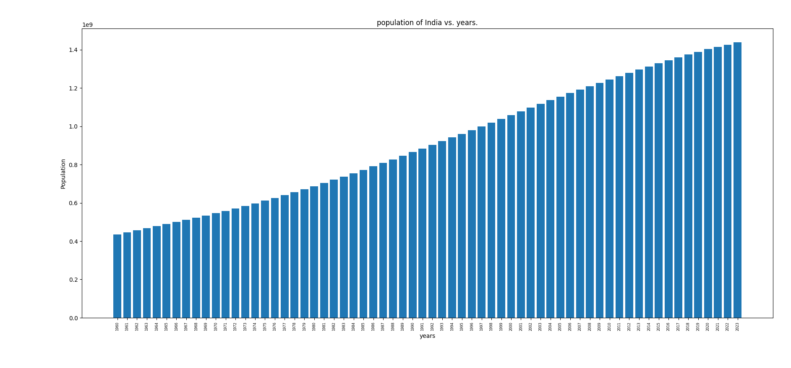
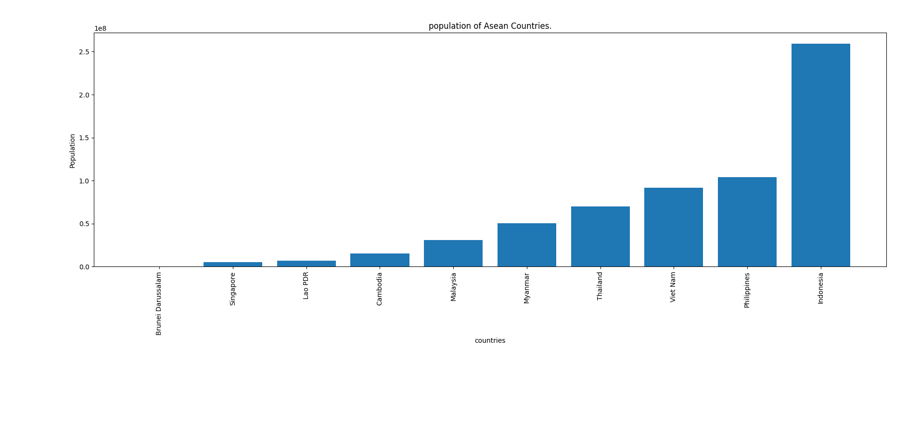
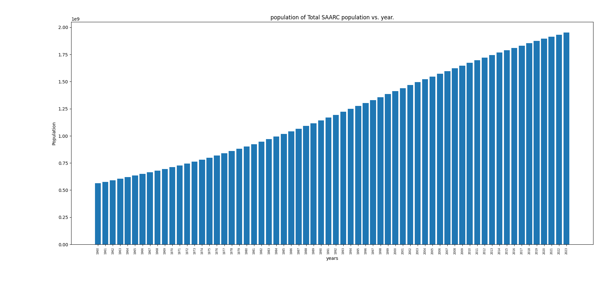
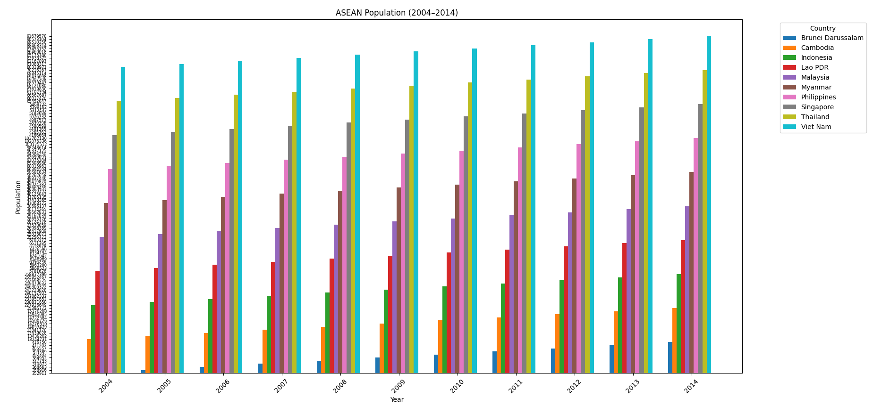

### How to Run the Project

#### 1. Clone the repository


```bash
git clone git@github.com:DwipenduKundu/UN_Population_data_analysis.git
cd company-master-data_analysis
```

#### 2. Set up a virtual environment (recommended)

```bash
python -m venv venv
#linux
source venv/bin/activate     
# On Windows: venv\Scripts\activate
```

#### 3. Install dependencies

```bash
pip install -r requirements.txt
```


```bash
gunzip data.csv.gz
```

#### 5. Run the script

##### go through the answers now

---


# Tasks

### Analytics on UN Population

#### Aim

To convert raw open data, country and year wise population estimates in this case, into charts that
tell some kind of story.

#### raw data

The data for this exercise is sourced from https://datahub.io/core/population-growth-estimates-and-projections/r/population-estimates.csv

*NOTE* You have to construct data for countries in ASEAN and SAARC, references follow ...

* ASEAN countries list
  https://en.wikipedia.org/wiki/ASEAN

* SAARC countries list
  https://en.wikipedia.org/wiki/South_Asian_Association_for_Regional_Cooperation

#### Instructions

1. Download all the data needed. Consult your mentor if you have any problems accessing the raw data.
1. Initialize python project with a separate virtualenv. All your code should be in Python.
1. Enable pylint for this project.
2. This project should have separate repo on Gitlab.com.
3. All projects should have README.md with instructions on how to run this project.

#### What your program should do

From the CSV and other source files specified above, write python code to ...
1. Read in the data.
2. Write logic to slice / dice / accumulate / transform the data.
3. Using matplotlib plot the plots specified in the following section.

#### Plots

##### 1: India population over years - Bar Plot

Make a Bar Plot of 'population of India' vs. years.


##### 2: For the year 2014. Bar Chart of population of ASEAN countries

ASEAN is a collection of South East Asian countries. Plot a Bar Chat of the population of
these countries. Only use data for the year 2014

##### 3: Over the years, TOTAL population of SAARC countries

In this case for **each year** you have to calculate the sum of the population
of all SAARC countries. Then plot a BAR CHART of **Total SAARC population** vs. year.

##### 4: Grouped Bar Chart - ASEAN population vs. years

Grouped Bar Charts: https://matplotlib.org/3.1.1/gallery/lines_bars_and_markers/barchart.html

In grouped bar charts we can group together may related bar of a single value of the x-axis.
You have to plot population of ASEAN countries as groups over the years 2004 - 2014.


# Answers:
### 1: India population over years - Bar Plot

Open Population1.py and run the script execute1() function will take care of everything.



----------------------
### 2: For the year 2014. Bar Chart of population of ASEAN countries

Open Population2.py and run the script execute2() function will take care of everything.



--------------------

### 3: Over the years, TOTAL population of SAARC countries

Open Population3.py and run the script execute3() function will take care of everything.


--------------------

### 4: Grouped Bar Chart - ASEAN population vs. years

Open Population3.py and run the script execute4() function will take care of everything.


